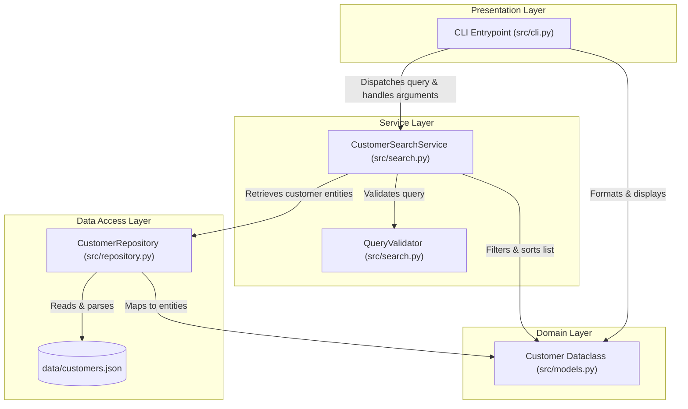

# Architecture

## Overview
The architecture for the **Customer Search** feature follows a minimalist layered architecture in Python 3.11+. It clearly decouples the presentation layer (CLI), business logic (search & validation services), domain entities, and the data access layer (repository over local JSON).



## Components
1. **`src/models.py` (Domain Layer):**
   - Declares the `Customer` entity using `@dataclasses.dataclass` with strict type annotations.
2. **`src/repository.py` (Data Access Layer):**
   - Implements `CustomerRepository`, handling deserialization from `data/customers.json` into typed `Customer` instances.
3. **`src/search.py` (Service & Business Logic Layer):**
   - Implements `CustomerSearchService` with `search(query: str) -> list[Customer]` and custom domain exceptions (`ValidationError`).
4. **`src/cli.py` (Presentation Layer):**
   - Command-line entrypoint using standard `argparse`. Parses arguments, invokes the service, formats output into clean ASCII tables, and manages exit codes (0 for success, 1 for errors).

## Responsibilities
| Component | Primary Responsibility | Anti-pattern / What it must NOT do |
| :--- | :--- | :--- |
| `models.py` | Defines data structure and types for `Customer`. | Business filtering logic or file I/O operations. |
| `repository.py` | Data persistence and file loading. | Query parsing, filtering logic, or CLI argument handling. |
| `search.py` | Normalization, substring matching, and validation. | Console printing, formatting, or `sys.exit` invocations. |
| `cli.py` | Argument parsing, exception catching, and formatting. | Implementing search filtering algorithms directly. |

## Data Flow
1. User invokes: `python3 -m src.cli --query "ana"` (or `python3 src/cli.py "ana"`).
2. `cli.py` parses arguments and invokes `CustomerSearchService.search("ana")`.
3. `CustomerSearchService` validates input (minimum 2 non-whitespace characters). If invalid, raises `ValidationError`.
4. The service requests customer records from `CustomerRepository`.
5. `CustomerRepository` loads `data/customers.json`, constructs `Customer` dataclass instances, and returns the collection.
6. `CustomerSearchService` filters records where `query.lower()` matches `name.lower()` or `email.lower()`, sorting matches by `id`.
7. `cli.py` renders the output:
   - If empty: prints informational message to stdout, exits with code 0.
   - If matches found: renders structured table to stdout, exits with code 0.
   - If `ValidationError` or I/O failure occurs: prints clean error message to stderr, exits with code 1.

## Interfaces
- **`Customer`**:
  ```python
  @dataclass
  class Customer:
      id: int
      name: str
      email: str
      phone: str
      status: str
  ```
- **`CustomerRepository`**:
  - `__init__(file_path: Path | str)`
  - `get_all() -> list[Customer]`
- **`CustomerSearchService`**:
  - `__init__(repository: CustomerRepository)`
  - `search(query: str) -> list[Customer]`
- **CLI Command**:
  - `python -m src.cli <query> [--file PATH]`

## Error Handling
- **`ValidationError`:** Custom exception raised in `src/search.py` when a query fails validation. Caught cleanly by `src/cli.py` without stack traces (`sys.exit(1)`).
- **`FileNotFoundError` / `json.JSONDecodeError`:** Caught during repository initialization or load phase; reports clear diagnostic message to stderr (`sys.exit(1)`).
- **Unexpected Failures:** Handled at top-level CLI boundary to guarantee clean process termination.

## Testing Strategy
1. **Unit Tests (`tests/test_search.py`):**
   - Verify partial matching in name and email, case-insensitivity, validation rejection on short/empty strings, using in-memory mock repositories.
2. **Repository Tests (`tests/test_repository.py`):**
   - Verify proper deserialization, missing file handling, and corrupt JSON parsing.
3. **CLI Integration Tests (`tests/test_cli.py`):**
   - Execute CLI invocations using `subprocess` or `capsys` to verify stdout, stderr, and canonical exit codes (`0` vs `1`).

## Dependencies
- **Runtime:** Python 3.11+ (Standard Library: `dataclasses`, `json`, `argparse`, `pathlib`, `typing`, `sys`).
- **Development & Testing:** `pytest`.

## Design Decisions
1. **In-Memory Filtering on JSON:** For small to medium local datasets (< 10,000 records), in-memory Python list comprehension executes in milliseconds (< 10 ms), comfortably satisfying NFR-01 (< 200 ms) without infrastructure overhead.
2. **Repository Abstraction:** Decouples business logic from disk storage, facilitating isolated unit testing without file system side-effects.
3. **Standard Library `argparse`:** Eliminates runtime external dependencies, fulfilling NFR-02.

## Trade-offs
- **Flat JSON vs Relational Database:** Zero setup and human-readable, but lacks multi-process write transaction locking (out of scope for read-only search feature).
- **Native Argparse vs Rich/Click:** Slightly more manual table formatting code, but zero dependency overhead.
